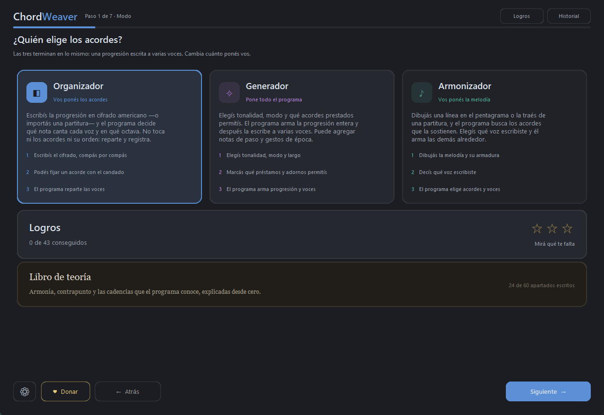
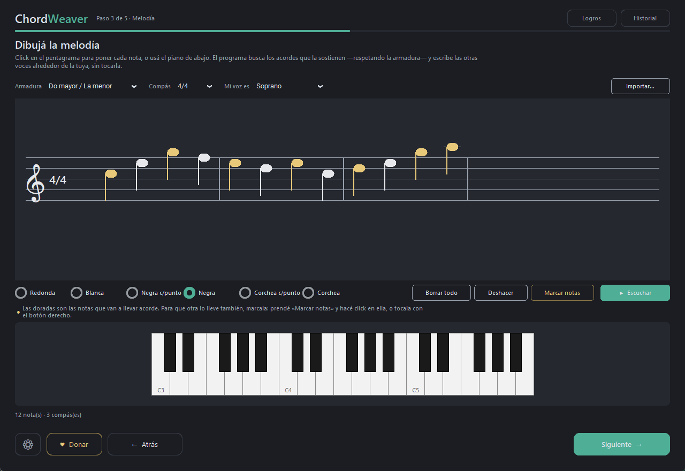
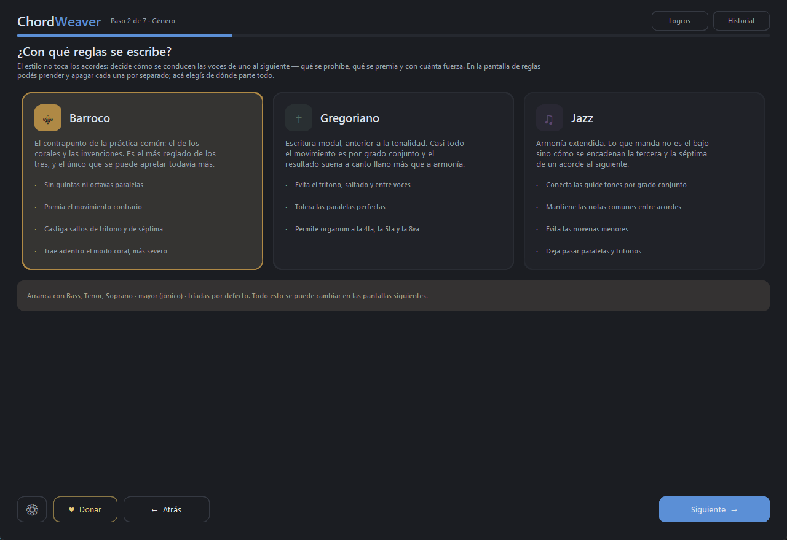
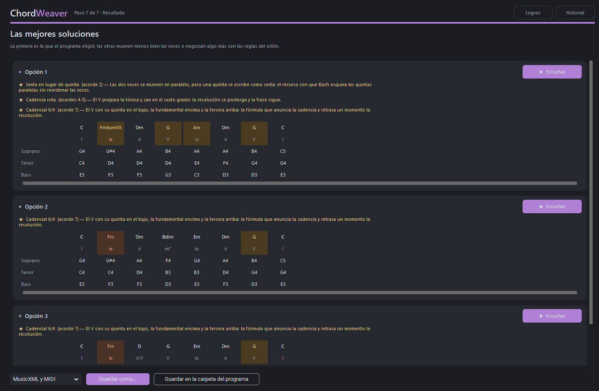
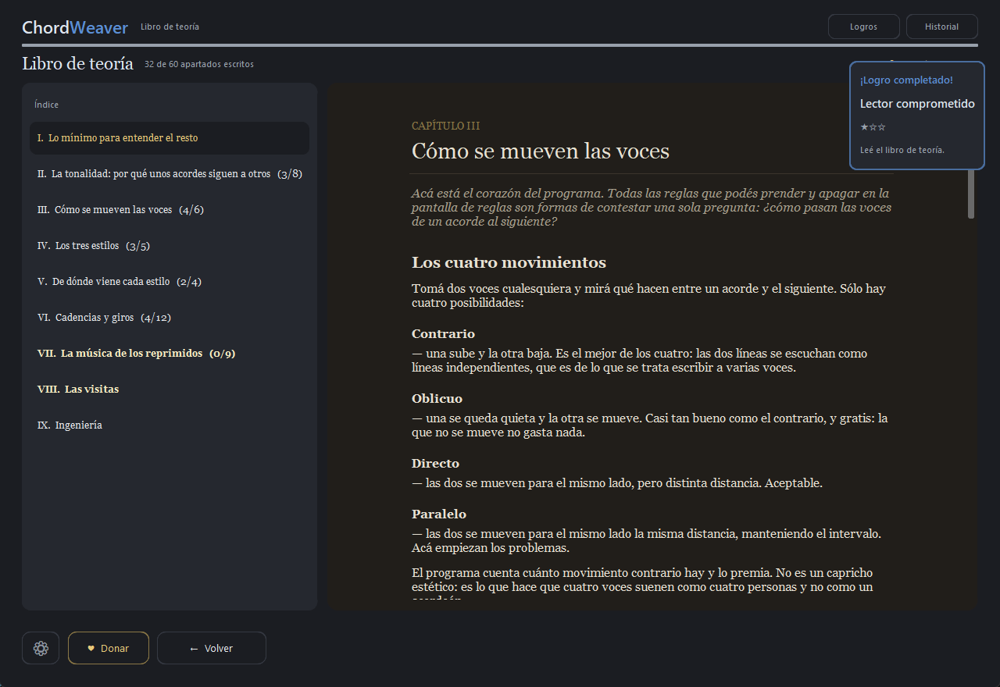
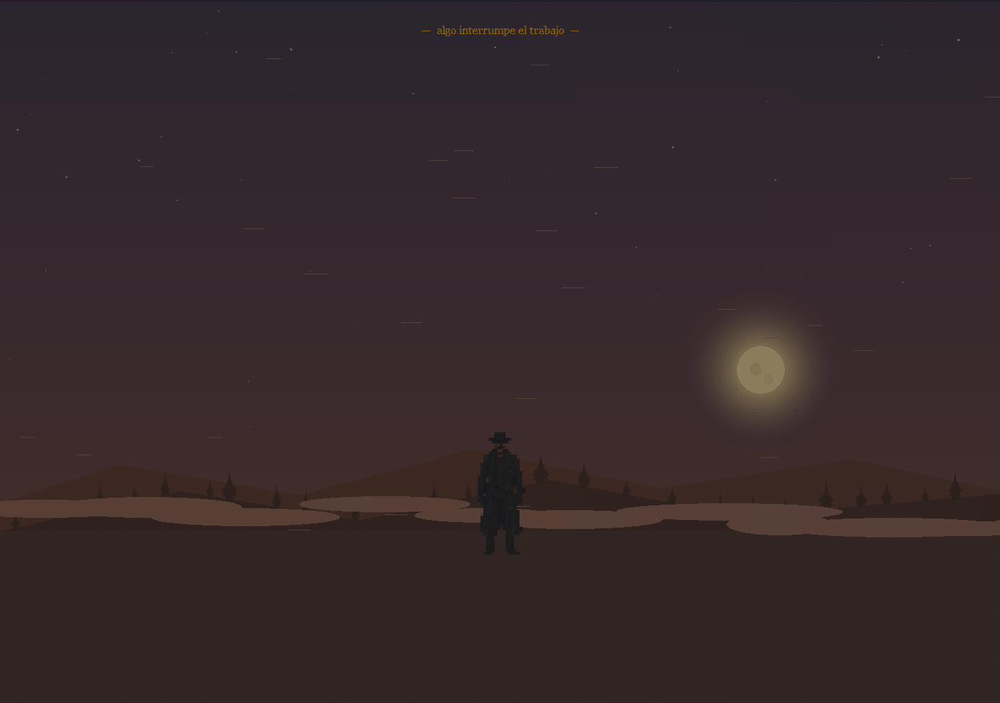

# ChordWeaver

**[chordweaver.github.io](https://chordweaver.github.io)** · [Descargar la última versión](https://github.com/ChordWeaver/chordweaver/releases/latest)

Tus acordes, tu melodía, o una hoja en blanco: un algoritmo genético convierte
cualquiera de las tres en una progresión escrita a varias voces. Decide qué nota
del acorde canta cada voz y en qué octava, para que el movimiento total sea el
mínimo posible sin romper las reglas de contrapunto del género elegido.

El AG **nunca cambia los acordes ni su orden** — sólo el registro y el reparto de
notas. En el Organizador los acordes los escribís vos; en el Generador los arma
el programa; en el Armonizador los busca debajo de la melodía que dibujaste.



*Los tres modos. Las tres terminan en lo mismo --- una progresión escrita a
varias voces --- y lo que cambia es cuánto ponés vos.*

## Estructura de carpetas (IMPORTANTE)

Tiene que quedar exactamente así. Si `engine/` no es una subcarpeta,
Python tira `No module named engine`:

```
ChordWeaver/
├── app.py                 <- la aplicación con interfaz
├── staff.py               <- el pentagrama que se puede escribir
├── cinematic.py           <- las escenas del modo historia
├── cli.py                 <- la misma lógica por línea de comandos
├── tests.py
├── README.md
├── requirements.txt
├── ChordWeaver.spec
└── engine/
    ├── __init__.py
    ├── theory.py          <- notas, voces, parser de cifrado
    ├── voicing.py         <- duplicaciones y omisiones
    ├── style.py           <- reglas de contrapunto por género
    ├── fitness.py         <- restricciones duras + penalizaciones
    ├── ga.py              <- torneo, elitismo, paralelismo
    ├── export.py          <- MusicXML y MIDI
    ├── history.py         <- últimas 10 producciones
    ├── book.py            <- el texto del libro de teoría
    ├── achievements.py    <- catálogo, estrellas y detectores
    ├── story.py           <- el modo historia: guion y estado
    ├── visitors.py        <- las visitas: quién aparece y cuándo
    ├── ambience.py        <- los ruidos, sintetizados a mano
    └── session.py         <- fachada
```

## Cómo correrlo

La aplicación con interfaz necesita una sola dependencia:

```bash
pip install customtkinter
python app.py
```

El motor por su cuenta es Python puro (3.9+) y no necesita nada instalado.
Parate en la carpeta `ChordWeaver/` y corré:

```bash
python tests.py                                        # 369 tests
python cli.py --chords "Cmaj7 Am7 Dm7 G7 Cmaj7" --genre jazz
python cli.py --chords "C Am F G C F G C" --genre chorale
python cli.py --chords "Dm7 G7 Cmaj7" --time 3/4 --duration 1
```

Los archivos salen en `output/`, al lado del código. Con `--out` elegís otra carpeta.

Si te tira `No module named engine`, casi siempre es una de estas dos:
1. Estás parado en otra carpeta -> hacé `cd` a la carpeta que contiene `cli.py`.
2. Los `.py` del motor quedaron sueltos en vez de adentro de `engine/`.

## Cómo se usa la interfaz

Siete pantallas en carrusel, siempre podés volver atrás. La primera elige el
modo de trabajo, que es lo que decide quién pone los acordes:

- **Organizador** — vos escribís la progresión (o la importás) y el programa
  sólo reparte las voces.
- **Armonizador** — vos dibujás la melodía y el programa le busca los acordes.
- **Generador** — el programa arma la progresión entera y después la escribe.

Cada modo tiene su color, y ese color tiñe el riel de progreso del encabezado
durante todo el recorrido.



*El Armonizador. Las notas doradas son las que van a llevar acorde, y se
recalculan con cada tecla: es la misma cuenta que hace la búsqueda, sin
elegir los acordes todavía. Podés marcar cualquier otra y ésa recibe el suyo.*

Las pantallas que siguen:

1. **Género** — define qué reglas se aplican y cómo se ponderan.
2. **Voces** — de 3 a 6 del catálogo (S, MS, A, T, Bar, B), con sus rangos editables.
3. **Compases** — métrica base y cantidad; cada compás puede tener otra métrica.
4. **Acordes** — cifrado americano con validación en vivo. Si el acorde tiene más
   notas que voces te avisa qué grados omite. Si no lo reconoce, el botón
   `piano` abre un teclado para elegir las notas a mano.
5. **Parámetros** — todos los switches de reglas y los parámetros del AG.
6. **Resultado** — las 3 mejores, y elegís formato y carpeta para guardar.



*La pantalla de género. El modo coral no es una tarjeta: es un switch
adentro de Barroco, porque es el mismo contrapunto apretado más fuerte.*



*El resultado. Las tres mejores, cada una con lo que el programa reconoció
adentro --- una cadencia rota, un 6/4 cadencial, una sexta en lugar de
quinta --- y explicado en una línea. Se escuchan sin salir de la pantalla.*

El botón `Historial` arriba a la derecha muestra las últimas 10 producciones.

## Tutorial y libro de teoría

La primera vez que se abre el programa arranca un recorrido guiado que resalta
cada modo y cada estilo sobre la interfaz real, con el resto de la pantalla
oscurecido. Se puede omitir en cualquier momento, y se vuelve a ver desde el
engranaje (`Ver el tutorial otra vez`). Al terminarlo o saltearlo lleva a la
pantalla de logros y otorga *Aprendiz*.

Debajo de los logros está el **libro de teoría**: armonía básica, conducción de
voces, los tres estilos, las cadencias que el programa reconoce --- con la
receta para que aparezcan --- y un capítulo de ingeniería sobre el algoritmo
genético. Está escrito para alguien que no estudió música. Abrirlo otorga
*Lector comprometido*.



El libro no está escrito entero de entrada: cada apartado está atado a un logro
y se escribe sólo cuando el usuario se topa con esa cadencia, ese movimiento o
ese recurso. Cuando eso pasa, el apartado nuevo aparece con una anotación a
mano al pie.

## Modo historia

Después de cinco minutos de uso --- y sólo con la pantalla inicial a la vista, el
tutorial terminado y ninguna búsqueda corriendo --- se enciende un botón dorado en
la pantalla inicial. No dice qué es. Cuando lo toques aparece una figura que
ofrece un poder, y lo que se le conteste abre uno de tres senderos:

| Respuesta | Sendero | Quién acompaña |
|---|---|---|
| Aceptar | Blues | el señor del sombrero |
| Ignorar | Jazz | un guitarrista anónimo |
| Rechazar | Góspel | Jesús |

Cada sendero son tres tramos y siempre en los mismos tres lugares: una progresión
escrita a mano en el **Organizador**, un botón dorado en el **Generador** y un
gesto dorado en el **Armonizador**. Los dos botones dorados nacen bloqueados:
para encenderlos hay que repetir la cadencia del tramo en tres tonalidades
distintas, y leer el apartado nuevo que el sendero escribió en el libro.

Los tramos automáticos no pasan por el algoritmo genético ni por los parámetros:
la pieza --- los doce compases del blues, *All of Me*, la regla de la octava del
góspel, *Amazing Grace* --- está escrita de antemano y sale al instante. Tampoco
reparten logros: la escribió el programa, no vos. Sí quedan en el historial y se
pueden exportar como cualquier otra.

El capítulo **VII** del libro, *La música de los reprimidos*, se llena con los
tramos recorridos en vez de con logros. Cuenta de dónde salió cada cosa: el
cruce de caminos del delta del Misisipi, los jazzes que no son uno solo, los
*spirituals* y el capitán de barco negrero que escribió *Amazing Grace*.

Al final de cada camino se entrega el logro legendario que le corresponde, su
título y un recuerdo, que queda al lado de los títulos en la pantalla de logros.
Ahí mismo está el botón **Arrepentirse**: vuelve a la encrucijada y deja elegir
de nuevo. Lo conseguido no se pierde --- los logros, los títulos y lo que quedó
escrito en el libro siguen siendo tuyos --- y lo único que vuelve a cero es el
sendero.



*Algo interrumpe el trabajo.*

Todo el sonido de las escenas --- el viento del valle, los pájaros, la voz de cada
personaje, el coro, los vientos que cierran un tema --- está sintetizado por el
programa, igual que el audio del botón `Escuchar`. No se empaqueta ningún archivo
de sonido.

## Paralelismo

La búsqueda usa varios procesos, no hilos: es trabajo de CPU puro en Python y
el GIL haría que los hilos se turnen en vez de correr en paralelo. La cantidad
se decide sola según la máquina donde corre (`workers=None`):

- deja un núcleo libre para que la ventana siga respondiendo,
- topea en 8 porque más allá el costo de serializar supera la ganancia,
- y se desactiva en trabajos chicos, donde paralelizar cuesta más de lo que ahorra.

Podés forzar un número con `GAConfig(workers=N)`.

## Géneros

| Género      | Paralelas 5tas/8vas | Tritono   | Voicings especiales | Carácter |
|-------------|---------------------|-----------|---------------------|----------|
| `classical` | prohibidas          | libre     | sí                  | premia movimiento contrario, saltos chicos |
| `chorale`   | prohibidas          | libre     | sí                  | como el clásico pero más estricto en espaciado y tesitura |
| `gregorian` | permitidas (organum)| prohibido | no                  | casi todo por grado conjunto |
| `jazz`      | permitidas          | libre     | sí                  | voicings cerrados, mantiene tensiones |

Todos los switches se pueden prender y apagar por separado; el género sólo
define el valor inicial.

## Reglas de contrapunto por género

Además de minimizar el movimiento, el fitness pondera las reglas propias de
cada tradición (ver `engine/style.py`):

- **Clásico / coral**: nunca duplicar la sensible; la séptima resuelve bajando
  y la sensible subiendo; sin solapamiento de voces entre acordes contiguos;
  saltos de tritono y séptima castigados; un salto grande se compensa con
  movimiento contrario; se premian las notas comunes y el movimiento contrario
  al bajo. El coral aplica todo esto más fuerte.
- **Gregoriano**: casi todo por grado conjunto, ámbito estrecho, segundas y
  séptimas entre voces castigadas, tritono prohibido por defecto.
- **Jazz**: se premia que las guide tones (3ra y 7ma) se conecten por grado
  conjunto, las séptimas bajan, se mantienen notas comunes y se evitan las
  novenas menores (avoid notes).

## Reglas duras vs penalizaciones

**Duras** (anulan el cromosoma, nunca aparecen en el resultado):
rangos vocales, cobertura del acorde, cruce de voces, y lo que prendas de
paralelas / tritono.

**Ponderadas** (el AG las negocia): movimiento total (el peso más grande),
tamaño de saltos, espaciado, tesitura, repetición estática de acorde,
quintas directas, movimiento contrario.

## Compilar el motor (opcional)

Los tres módulos que la búsqueda pisa millones de veces por corrida --el
evaluador, las reglas de estilo y la representación de las notas-- se pueden
compilar a C con Cython:

```bash
pip install cython setuptools     # además de MSVC (Build Tools de Visual Studio)
python build_engine.py            # deja engine/*.pyd al lado de los .py
python build_engine.py --clean    # los borra y vuelve a Python puro
```

**Es opcional y no cambia nada de lo que el programa hace.** Los `.py` no se
tocan: se compilan tal como están, con una hoja de tipos aparte
(`engine/fitness.pxd`, `engine/style.pxd`) que Python ignora. Si el `.pyd`
está al lado del `.py`, Python lo prefiere solo; si no está, corre el `.py`.
Sin compilador el programa anda igual, más lento, y `pyinstaller
ChordWeaver.spec` sigue dando un ejecutable que funciona.

Medido sobre 16 acordes con la búsqueda de fábrica (200x300): la búsqueda pasa
de 17,4 a 8,2 segundos en un proceso y de 8,3 a 5,7 con los ocho del pool. El
resultado es idéntico bit a bit --verificado sobre 14 corridas, cuatro géneros
por tres semillas más los dos modos generativos.

## Empaquetar el .exe

```bash
pip install pyinstaller customtkinter
pyinstaller ChordWeaver.spec
```

Queda en `dist/ChordWeaver/`, portable: copiala a donde quieras. Es build de
carpeta y no `--onefile` a propósito, porque con onefile el programa se
descomprime en un temporal y el historial no persistiría al lado del exe.

## Auditoría contrapuntística (`python audit.py`)

La pregunta que responde: ¿cada género *realmente* escribe según su tradición,
o todos convergen a "la solución que menos se mueve" con distinta etiqueta?

El script corre varias progresiones con cada género y mide el resultado contra
reglas que el fitness nunca ve como un solo número, comparando siempre contra
un control: la misma búsqueda con todos los pesos de estilo apagados.

Resultados medidos (promedio sobre 4 progresiones x 2 semillas):

| métrica | control | clásico | coral | gregoriano | jazz |
|---|---|---|---|---|---|
| % grado conjunto | 86.5 | 79.2 | 79.0 | **91.2** | 87.0 |
| % movimiento contrario | 11.3 | **18.8** | **20.8** | 13.1 | 10.1 |
| 5tas/8vas paralelas | 1.5 | **0.0** | **0.0** | 1.4 | 2.0 |
| solapamientos | 0.4 | **0.0** | **0.0** | 0.0 | 0.0 |
| % 7mas que resuelven bajando | 67.9 | **85.7** | **96.4** | 67.9 | 78.6 |
| % guide tones por grado | 41.6 | 37.5 | 32.1 | 41.0 | **51.9** |
| ambitus medio por voz | 4.7 | 5.4 | 5.5 | **3.8** | 5.3 |
| % perfectas sobre el bajo | 36.5 | 40.1 | 36.5 | 39.6 | 39.1 |

Lectura honesta:

- **Clásico y coral se diferencian con claridad.** El movimiento contrario casi
  se duplica y las séptimas pasan de resolver 68% a 86-96%. No es placebo.
- **Jazz se diferencia moderadamente**: las guide tones conectan por grado 52%
  contra 42% del control.
- **Gregoriano es el más débil**, y hay una razón estructural: el carácter modal
  vive sobre todo en la *armonía* (cadencias modales, ausencia de sensible,
  quintas al aire), y en esta app los acordes los elige el usuario. Lo único que
  el AG controla es el registro y el reparto de notas. Igual se diferencia donde
  sus reglas apuntan: ambitus 3.8 contra 4.7, y más intervalos perfectos.
- Los géneros con reglas fuertes **pagan** movimiento por estilo (1.3 contra 1.2
  semitonos de media), que es exactamente el intercambio que se busca.

Durante la auditoría se detectó que el umbral de ambitus estaba en 9 semitonos
cuando los ámbitos reales rondan 5, o sea que la regla no se activaba nunca.
Corregido a 5.

## Las visitas

Aparte del sendero hay cuatro apariciones sueltas. No se eligen y no se pueden
abandonar: ocurren cuando ocurren, y cada una deja algo.

| Quién | Cuándo | Qué deja |
|---|---|---|
| Bach | a la quinta partitura barroca | el capítulo VIII del libro |
| Bach, otra vez | la primera vez que se usa el modo coral | otro apartado |
| Gregorio I | a la quinta partitura gregoriana | otro apartado |
| Una entidad encapuchada | al conseguir el 100% de los logros | la partitura quemada y la lista de los huevos |

Los dos maestros felicitan y explican: Bach, que la música se escribía en voces
y no en acordes, y que es lo que separa a un coral de todo lo demás; Gregorio,
el organum --- la *vox principalis* y su sombra a la quinta ---, que es de donde
sale todo lo que el programa hace. Los dos cierran con una cita suya de verdad.

La entidad no explica nada. Dice que estuvo mirando, que no entiende cómo se
llegó hasta ahí, y avisa de alguien que va a venir. Deja el cuarto objeto ---
una partitura quemada de la que no se llega a leer de quién es --- y, al pie de
la pantalla de logros, la lista de los seis huevos de pascua con los pasos
exactos para provocarlos. Es lo único del programa que los nombra: hasta ese
momento el contador dice cuántos hay y ninguno cuál.

La quinta aparición es **la visión**, y es la única que no se puede provocar de
ninguna manera. Al abrir el programa, una vez de cada cinco --- con el tutorial
ya hecho u omitido --- y una sola vez en la vida, se ve un camino de tierra de
noche, la luna llena y un tren cruzando a lo
lejos. Nadie habla y el programa tampoco: no avisa nada al terminar. Queda
escrita en el libro la historia de Robert Johnson, en dorado, como un legendario,
y hay que ir a encontrarla.

Para mirarlas hay dos caminos. En la configuración --- el engranaje --- hay una
sección **Escenas (prueba)** con un botón por aparición; es provisoria y se saca
cuando deje de hacer falta. Y desde afuera, dos variables de entorno:
`CHORDWEAVER_VISIT` fuerza una visita al abrir (`watcher`, `bach_baroque`,
`bach_chorale`, `gregory`) y `CHORDWEAVER_VISION=1` fuerza la visión.

Las dos formas juegan la escena entera y entregan lo que entrega de verdad, así
que la que mires desde ahí no vuelve a aparecer sola.

## Importar una partitura

En el modo de acordes propios, el botón `Importar partitura...` lee un archivo
MusicXML (`.musicxml`, `.xml` o `.mxl` comprimido) y carga sus acordes con su
ritmo y sus compases. El orden de las voces que trae el archivo queda como
punto de partida y es lo que propone el candado, pero el programa puede
reacomodarlo: para eso se importa. Si querés conservar una disposición tal
cual vino, fijala con el candado.

## Cómo contribuir

Las reglas del proyecto --- qué no se toca, qué hay que correr antes de un pull
request y las cinco trampas que fallan en silencio --- están en
[`CONTRIBUTING.md`](CONTRIBUTING.md). Antes de tocar cualquier cosa musical,
[`MUSIC_LOGIC.md`](MUSIC_LOGIC.md).

## Estado

- Parte 1 (motor): terminada y testeada (369 tests).
- Parte 2 (interfaz): terminada. Probada de punta a punta bajo display virtual,
  pero **no** en Windows real ni empaquetada como .exe -- eso lo tenés que
  verificar vos.

## Licencia

[MIT](LICENSE).
